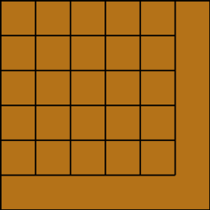
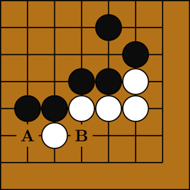

# GoBoardTikZ

### Klasse
Die Klasse `GoBoard` erstellt TikZ-Pictures von verschiedenen Go Stellungen.

Die initiallisierung erfolgt über den Aufruf des Konstruktors.

~~~python
dimensions = (9, 9)
brett = GoBoard(dimensions, left=False, top=False)
~~~

Dem Konstruktor muss eine `size` übergeben werden (im Beispiel das Tuple 'dimensions'). Diese gibt die Zeilen- und Spaltenanzahl des Bretts an. Des Weiteren können die attribute `left`, `top`, `right`, `bottom` mit dem Wert `False` überschrieben werden, um den jeweiligen Rand des Bretts verschwinden zu lassen.

### Erstellung des TikZ Codes
Der Aufruf der methode `make` erstellt den LaTex TikZ Picture Code.
~~~python
brett.make()
~~~
Erzeugt den folgenden Code:
~~~
\begin{tikzpicture}
\draw [very thick, draw=black, fill=brown!60!yellow!80!red!80!black] rectangle (6, 6) ++ (0, 0);
\draw [very thick, black] (1,1) -- (1,6);
\draw [very thick, black] (2,1) -- (2,6);
\draw [very thick, black] (3,1) -- (3,6);
\draw [very thick, black] (4,1) -- (4,6);
\draw [very thick, black] (5,1) -- (5,6);
\draw [very thick, black] (0,1) -- (5,1);
\draw [very thick, black] (0,2) -- (5,2);
\draw [very thick, black] (0,3) -- (5,3);
\draw [very thick, black] (0,4) -- (5,4);
\draw [very thick, black] (0,5) -- (5,5);
\end{tikzpicture}
~~~
Dieser Code wiederum erzeugt in LaTex folgendes Bild:

Als weitere Elemente für die `make` mathode können listen von Positionen übergeben werden in der Form `[(x0, y0), (x1, y1), (x2, y2) ... ]`. Diese Listen können für die Attribute `white` und `black` für Steine, `marked` für Dreiecksmartierunge, `circle` für Kreismarkierungen und `number` für eine Durchnummerierung der einzelnen Positionen übergeben werden.

~~~python
dims = (6,6)

brett = GoBoard(dims, left=False, top=False)

b = [(3, 4), (4, 4), (2, 3), (1, 3), (5, 5), (4, 6)]
w = [(4, 3), (3, 3), (2, 2), (5, 4), (5, 3)]
c = [(3, 4)]
m = [(4, 3)]
n = [(4, 4), (3, 3), (2, 3), (2, 2), (1, 3), (5, 4), (5, 5), (4, 6), (5, 3)]

tikz = brett.make(white=w, black=b, circle=c, marked=m, number=n)
print(tikz)
~~~

Erstellt den Code:

~~~
\begin{tikzpicture}
\draw [very thick, draw=black, fill=brown!60!yellow!80!red!80!black] rectangle (7, 7) ++ (0, 0);
\draw [very thick, black] (1,1) -- (1,7);
\draw [very thick, black] (2,1) -- (2,7);
\draw [very thick, black] (3,1) -- (3,7);
\draw [very thick, black] (4,1) -- (4,7);
\draw [very thick, black] (5,1) -- (5,7);
\draw [very thick, black] (6,1) -- (6,7);
\draw [very thick, black] (0,1) -- (6,1);
\draw [very thick, black] (0,2) -- (6,2);
\draw [very thick, black] (0,3) -- (6,3);
\draw [very thick, black] (0,4) -- (6,4);
\draw [very thick, black] (0,5) -- (6,5);
\draw [very thick, black] (0,6) -- (6,6);
\draw [very thick, draw=black, fill=white] (4, 3) circle (0.475);
\draw [very thick, draw=black, fill=white] (3, 3) circle (0.475);
\draw [very thick, draw=black, fill=white] (2, 2) circle (0.475);
\draw [very thick, draw=black, fill=white] (5, 4) circle (0.475);
\draw [very thick, draw=black, fill=white] (5, 3) circle (0.475);
\draw [very thick, draw=black, fill=black!95!white] (3, 4) circle (0.475);
\draw [very thick, draw=black, fill=black!95!white] (4, 4) circle (0.475);
\draw [very thick, draw=black, fill=black!95!white] (2, 3) circle (0.475);
\draw [very thick, draw=black, fill=black!95!white] (1, 3) circle (0.475);
\draw [very thick, draw=black, fill=black!95!white] (5, 5) circle (0.475);
\draw [very thick, draw=black, fill=black!95!white] (4, 6) circle (0.475);
\draw [black] (4, 3) node {\scalebox{1.75}{$\boldsymbol{\bigtriangleup}$}};
\draw [white] (3, 4) node {\scalebox{1.75}{$\boldsymbol{\bigcirc }$}};
\draw [white] (4, 4) node {\scalebox{1.75}{\textbf{1}}};
\draw [black] (3, 3) node {\scalebox{1.75}{\textbf{2}}};
\draw [white] (2, 3) node {\scalebox{1.75}{\textbf{3}}};
\draw [black] (2, 2) node {\scalebox{1.75}{\textbf{4}}};
\draw [white] (1, 3) node {\scalebox{1.75}{\textbf{5}}};
\draw [black] (5, 4) node {\scalebox{1.75}{\textbf{6}}};
\draw [white] (5, 5) node {\scalebox{1.75}{\textbf{7}}};
\draw [white] (4, 6) node {\scalebox{1.75}{\textbf{8}}};
\draw [black] (5, 3) node {\scalebox{1.75}{\textbf{9}}};
\end{tikzpicture}
~~~
Welcher folgendes Bild erstellt:

Zusätzlich können auch noch weitere Markierungen gewählt werden, die noch nicht im Code spezifiziert sind. Möchte man ein Feld mit  dem Buchstaben 'A' betiteln so kann man dies als Übergabe für das Attribut `A` tun, auch ohne, dass das Attribut `A` vorher im Code spezifiziert wurde.

~~~python

~~~
Erstellt den Code:
~~~
\begin{tikzpicture}
\draw [very thick, draw=black, fill=brown!60!yellow!80!red!80!black] rectangle (7, 7) ++ (0, 0);
\draw [very thick, black] (1,1) -- (1,7);
\draw [very thick, black] (2,1) -- (2,7);
\draw [very thick, black] (3,1) -- (3,7);
\draw [very thick, black] (4,1) -- (4,7);
\draw [very thick, black] (5,1) -- (5,7);
\draw [very thick, black] (6,1) -- (6,7);
\draw [very thick, black] (0,1) -- (6,1);
\draw [very thick, black] (0,2) -- (6,2);
\draw [very thick, black] (0,3) -- (6,3);
\draw [very thick, black] (0,4) -- (6,4);
\draw [very thick, black] (0,5) -- (6,5);
\draw [very thick, black] (0,6) -- (6,6);
\draw [very thick, draw=black, fill=white] (4, 3) circle (0.475);
\draw [very thick, draw=black, fill=white] (3, 3) circle (0.475);
\draw [very thick, draw=black, fill=white] (2, 2) circle (0.475);
\draw [very thick, draw=black, fill=white] (5, 4) circle (0.475);
\draw [very thick, draw=black, fill=white] (5, 3) circle (0.475);
\draw [very thick, draw=black, fill=black!95!white] (3, 4) circle (0.475);
\draw [very thick, draw=black, fill=black!95!white] (4, 4) circle (0.475);
\draw [very thick, draw=black, fill=black!95!white] (2, 3) circle (0.475);
\draw [very thick, draw=black, fill=black!95!white] (1, 3) circle (0.475);
\draw [very thick, draw=black, fill=black!95!white] (5, 5) circle (0.475);
\draw [very thick, draw=black, fill=black!95!white] (4, 6) circle (0.475);
\draw [draw=brown!60!yellow!80!red!80!black ,fill=brown!60!yellow!80!red!80!black] (1, 2) circle (0.4);\draw [draw=black] (1, 2) node {\scalebox{1.75}{\textbf{A}}};
\draw [draw=brown!60!yellow!80!red!80!black ,fill=brown!60!yellow!80!red!80!black] (3, 2) circle (0.4);\draw [draw=black] (3, 2) node {\scalebox{1.75}{\textbf{B}}};
\end{tikzpicture}
~~~
Welcher folgendes Bild erstellt:

